<picture>
  <source media="(prefers-color-scheme: dark)" srcset="https://github.com/Highsun/snk/raw/output/github-snake-dark.svg" />
  <source media="(prefers-color-scheme: light)" srcset="https://github.com/Highsun/snk/raw/output/github-snake.svg" />
  
</picture>

